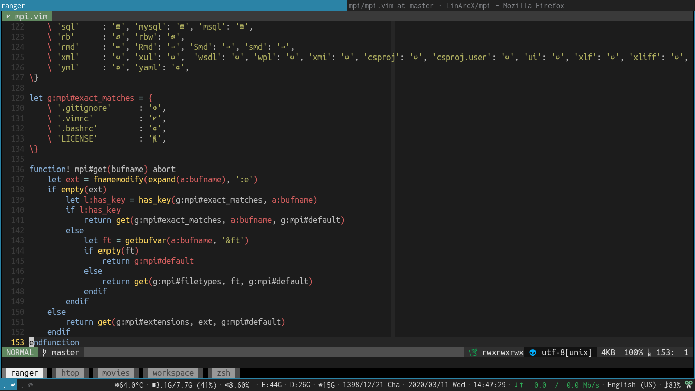

<h1 align="center">
	
    <br/>
    <h4 align="center">Using mpi in my customized tabline called: mptbl</h4>
</h1>

## Installation
Just copy `mpi.vim` into your `plugin` directory.

## Why?
- [KISS](https://en.wikipedia.org/wiki/KISS_principle)
- I like [vim-devicons](https://github.com/ryanoasis/vim-devicons). But it cares too much about integrating with other plugins. Its code is huge get such a simple task.(getting file type icons)
- I like to manipulate and discover things and see what's going on under the hood(And i encourage you, too). So, instead of just using a huge plugin, install a minimal alternative and change it according to your needs.

## How use it?
Just call `mpi#get(<name of buffer>)` to get its related icon. For exmaple use this command to see what'll happen:

`:echo mpi#get(expand('%:t'))`

## Customization
You can add [unicode emojies](https://en.wikipedia.org/wiki/Template:Emoji_(Unicode_block)) like this:

```
let g:mpi#exact_matches = {
    ...
    \ '.zshrc'                           : '🌍',
    \ '.zsh_history'                     : "\<Char-0x23f0>",
    \ '.fehbg'                           : '🐈',
    ...
\}
```

Filetypes are here:
`/usr/share/nvim/runtime/filetype.vim`

## License

